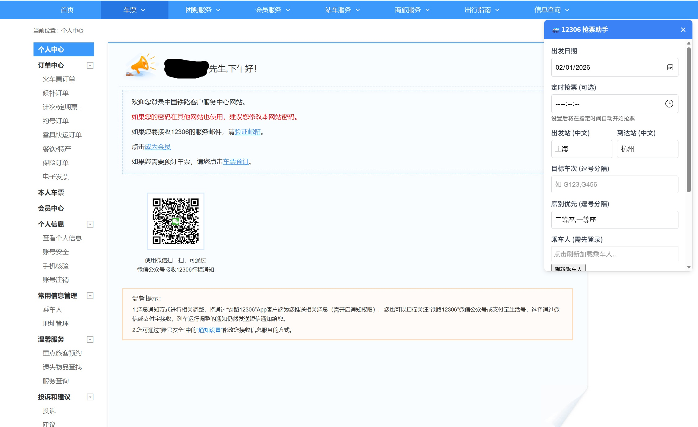
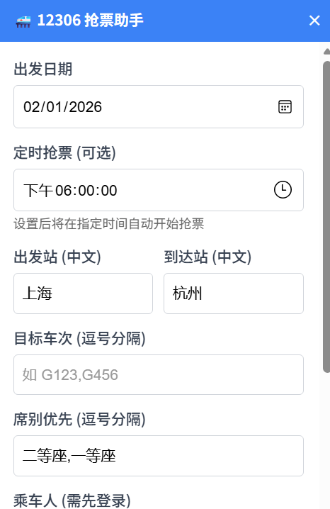
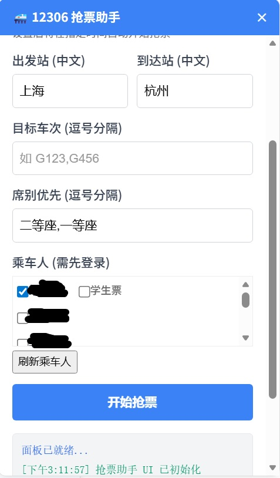

# 🚄 12306 抢票助手 Pro

这是一款专为 12306 官网设计的 Tampermonkey（油猴）脚本，集成了自动查票、自动提交订单、定时抢票、多席别/多车次优选等功能。脚本界面简洁，支持拖拽，旨在帮助用户提高购票成功率。
**有意者可以加入QQ裙：1101251488**
---

## 📦 安装说明

1.  **安装 Tampermonkey 插件**
    *   如果您还没有安装 Tampermonkey，请前往 [Tampermonkey 官网](https://www.tampermonkey.net/) 或者[脚本猫 官网]（https://docs.scriptcat.org/）下载并安装适用于您浏览器的扩展程序（Chrome, Edge, Firefox, Safari 等均支持）。
2.  **添加脚本**
    *   在 Tampermonkey 管理面板中，点击“添加新脚本”。
    *   将 `ticket_helper.js` 中的代码完整复制并粘贴到编辑器中。
    *   点击“文件” -> “保存”（或 Ctrl+S）。
3.  **生效**
    *   打开或刷新 [12306 官网](https://kyfw.12306.cn/otn/leftTicket/init) (**注意: 最好在"个人中心"页面操作**)，您应该能在页面右上方看到蓝色的“12306 抢票助手”悬浮面板。

---

## 🛠️ 功能介绍

### 1. 基础配置
*   **出发/到达站**：直接输入中文站点名称（如“上海”、“杭州”）。脚本会自动从 12306 获取最新的站点简码表进行转换。
*   **出发日期**：选择您计划出行的日期。
*   **目标车次**：输入您想购买的车次号，支持多车次，用逗号分隔（如 `G123,G456`）。脚本会按顺序优先匹配。
*   **席别优先**：输入您期望的席别，支持多席别，用逗号分隔（如 `二等座,一等座`）。脚本会优先尝试靠前的席别。

### 2. 乘车人选择
*   **需先登录**：使用前请确保您已在 12306 官网完成登录。
*   **刷新列表**：点击“刷新乘车人”按钮，脚本会自动加载您账户下的常用联系人。
*   **学生票支持**：如果是学生类型乘客，勾选后会额外显示“学生票”复选框，勾选即可购买学生票。

### 3. 定时抢票（核心功能）
*   **设定时间**：在“定时抢票”输入框中设置开售时间（精确到秒，如 `14:00:00`）。
*   **倒计时模式**：点击“开始抢票”后，如果时间未到，脚本会自动进入倒计时状态。
*   **智能保活**：
    *   在等待期间，脚本会随机间隔发送心跳请求，保持 12306 登录状态（Session）不失效。
    *   **深度保活**：会定期预热下单页面，防止服务器回收下单上下文。
    *   **临战静默**：在开售前 2 分钟，脚本会自动停止所有保活请求，确保网络通道畅通，全力准备抢票。
*   **自动触发**：倒计时归零瞬间，脚本立即启动高频查票和下单流程。

---

## 🚀 使用流程

1.  **登录账号**：进入 12306 官网并登录, 进入"个人中心"页面。
2.  **填写信息**：在悬浮面板中填好出发地、目的地、日期、车次和席别。
3.  **选择乘客**：点击刷新并勾选乘车人。
4.  **设置定时（可选）**：如果是抢整点发售的票，请设置好时间 (建议当天设置,不要跨日)。
5.  **开始运行**：
    *   点击“**开始抢票**”按钮。
    *   如果是立即抢票，脚本会开始轮询查票。
    *   如果是定时抢票，可以将标签页置于后台运行，无需保持前台,但建议设置12306站点的标签页不进入节能状态。
6.  **下单成功**：
    *   一旦抢票成功，脚本会弹出提示框，并播放成功日志。
    *   请尽快前往 12306“未完成订单”页面完成支付（脚本**不会**自动支付）。

---

## ⚠️优化了以下内容

**1. 🎯 抢票成功自动跳转支付页**
下单成功后自动提取订单号，并 1.5 秒后自动跳转到 https://kyfw.12306.cn/otn/pay/init
完全不需要手动点击 alert，真正实现无人值守直接进入支付界面

**2. 🔔 非阻塞提示 + 声音提醒**
去掉原来会阻塞线程的 alert，改用 浏览器桌面通知（需允许权限）和 蜂鸣提示音（Web Audio API）
即使你不在电脑前，也能第一时间从手机或其他设备收到成功通知

**3. 🩹 修复学生票判断 bug**
原来使用 p.passenger_type == '3' 可能因类型不一致导致判断错误
优化为 严格字符串对比 String(p.passenger_type) === '3'，保证学生票逻辑准确

**4. 🛡️ 保活策略更安全**
删除了原脚本中向服务器发送空 secretStr 的 submitOrderRequest，这个行为容易被风控识别
改为更自然的方式：直接请求 initDc 页面，失败时回退到检查登录状态

**5. 🚨 验证码场景处理**
下单失败时会检测错误信息是否包含“验证码”或“captcha”
一旦出现验证码，脚本会自动终止当前任务并明确提示需要手动处理，避免无意义的重试消耗

**6. 🕵️ 查票间隔随机化**
将固定 2 秒轮询改为 2~3 秒随机延迟
模拟人类操作节奏，降低被 12306 反爬系统识别的风险

**7. 🧱 站点简码强校验**
如果简码表加载失败或站名无法转换，脚本现在会 直接报错并阻止开始抢票
避免用中文站名去发送无效请求，浪费机会

**8. 💬 UI 优化**
面板底部添加了“抢票成功后将自动跳转支付页”的提示说明
乘车人加载、抢票状态等日志更加清晰

## ⚠️ 注意事项
*   **休眠问题**：为了防止电脑进入休眠状态，建议将系统设置为“永不休眠”。
*   **保持标签页**：强烈建议在浏览器设置当前站点不进入节能状态，防止脚本运行被中断。
*   **支付提醒**：脚本仅负责提交订单，**支付环节需用户手动完成**。

---

## 📝 常见问题

**Q: 点击“刷新乘车人”没反应？**
A: 请确认您是否已登录 12306。如果已登录，请尝试刷新页面后重试。

**Q: 为什么有时候抢票失败？**
A: 抢票成功率受限于 12306 服务器拥堵程度、网络延迟以及票源数量。脚本能提高手速和自动化程度，但无法创造票源。

---
*祝您购票愉快，出行顺利！*
